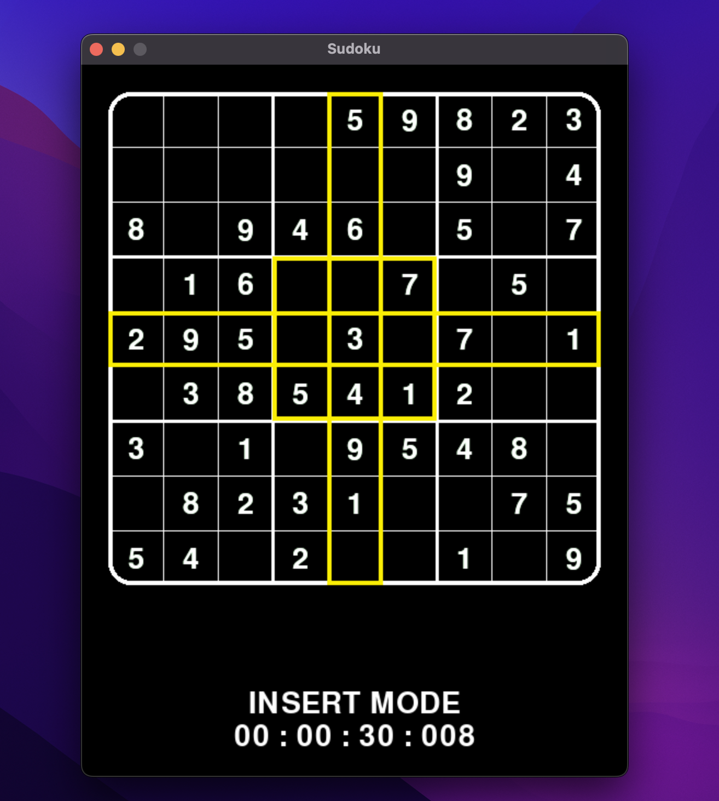

# Project Details
## Sudoku
This is a sudoku game made with Pygame. It has a fairly moderate GUI accompanying the game to add a little bit of elegance. The entire code was written in python. 
Note: This project is subject to future tweaks, changes and improvements

## Features
### 1. Sudoku Game
* This project contains a playable Sudoku game made with Pygame
* The Sudoku game has the following features
    * A timer to mark the time spent on a particular game
    * Two modes
        * Insert Mode: This allows users to insert their answers into a particular position
        * Note Mode: This allows the player to pencil one number into a particular cell

            The current mode is displayed at the buttom of the screen  
            __Note: The notes are currently limited to one value per cell__
    * Highlighting: The column, row and subgrid of the mouse's current position is highlighted. This makes it easy to know the values in the current row, column and subgrid
    * Colored Hints: In addition to displaying a tick if the entered value is correct or an X if not, the colors of the numbers reflect this too. The original contents of the board are displayed in white. The correctly entered values are displayed in green and wrong values in red. The notes are displayed in yellow  
Run `main.py` to play
### 2. A Sudoku Solver and a Visualizer
* The solving algorithm utilizes backtracking
* The visualizer shows how the computer is processing potential candidates
* Initially, all the logically deducible values are displayed  
This means that each cell is analyzed for its potential candidates. If there is only one candidate, that candidate is accepted. after this, the backtracking begins
* The current cell being worked on is highlighted. During the backtracking process, the wrong cells are highlighted in red
### 3. A Terminal Based Solver
* While this lacks the visualization feature, a highly stylized Sudoku board can be viewed in the console
* This uses the Unicode Box characters  
__Note: The console version does not have a playable sudoku game although it may be easy to make__
### 4. A Sudoku Generator
* With the intuition of a solver, I made a Sudoku generator which **does not** guarantee a unique solution  
However, the Sudoku game itself has a unique solution and is derived from the generator

## How to play
* Use the sudoku rules
* To insert a value, click on the cell in the grid and enter a value from 1 to 9. Moving the mouse away from that cell interrupts the process
* To delete an inserted value, click the cell and type "0"
* To switch modes, type "N"
* To insert a note, follow the same processes as insert but while in Note mode
* To delete a note, hit the backspace key or type "0"
* If you want to supply the note as an answer, click on the cell and hit the enter key
* To start the solver, hit the space bar

# Notes
On quite a number of occassions, the sudoku board may take a while to be created. This is because a Sudoku with a unique solution is trying to be generated. However, there is no guarantee for the uniqueness of a created board but so far, in my tests, it works. Additionally, i used this project as an introduction to `numpy` and `pygame`.  



```
 ┳━━━┳━━━┳━━━┳━━━┳━━━┳━━━┳━━━┳━━━┳━━━┳
 ┃ 9 ┆ 8 ┆ 4 ┃ 3 ┆ 2 ┆ 7 ┃ 6 ┆ 5 ┆ 1 ┃ 
 ╋┄┄┄╋┄┄┄╋┄┄┄╋┄┄┄╋┄┄┄╋┄┄┄╋┄┄┄╋┄┄┄╋┄┄┄╋
 ┃ 7 ┆ 3 ┆ 1 ┃ 5 ┆ 6 ┆ 8 ┃ 4 ┆ 2 ┆ 9 ┃ 
 ╋┄┄┄╋┄┄┄╋┄┄┄╋┄┄┄╋┄┄┄╋┄┄┄╋┄┄┄╋┄┄┄╋┄┄┄╋
 ┃ 5 ┆ 6 ┆ 2 ┃ 9 ┆ 4 ┆ 1 ┃ 8 ┆ 3 ┆ 7 ┃ 
 ╋━━━╋━━━╋━━━╋━━━╋━━━╋━━━╋━━━╋━━━╋━━━╋
 ┃ 2 ┆ 7 ┆ 5 ┃ 4 ┆ 9 ┆ 6 ┃ 1 ┆ 8 ┆ 3 ┃ 
 ╋┄┄┄╋┄┄┄╋┄┄┄╋┄┄┄╋┄┄┄╋┄┄┄╋┄┄┄╋┄┄┄╋┄┄┄╋
 ┃ 4 ┆ 9 ┆ 6 ┃ 8 ┆ 1 ┆ 3 ┃ 2 ┆ 7 ┆ 5 ┃ 
 ╋┄┄┄╋┄┄┄╋┄┄┄╋┄┄┄╋┄┄┄╋┄┄┄╋┄┄┄╋┄┄┄╋┄┄┄╋
 ┃ 3 ┆ 1 ┆ 8 ┃ 7 ┆ 5 ┆ 2 ┃ 9 ┆ 6 ┆ 4 ┃ 
 ╋━━━╋━━━╋━━━╋━━━╋━━━╋━━━╋━━━╋━━━╋━━━╋
 ┃ 8 ┆ 4 ┆ 7 ┃ 2 ┆ 3 ┆ 9 ┃ 5 ┆ 1 ┆ 6 ┃ 
 ╋┄┄┄╋┄┄┄╋┄┄┄╋┄┄┄╋┄┄┄╋┄┄┄╋┄┄┄╋┄┄┄╋┄┄┄╋
 ┃ 1 ┆ 2 ┆ 9 ┃ 6 ┆ 7 ┆ 5 ┃ 3 ┆ 4 ┆ 8 ┃ 
 ╋┄┄┄╋┄┄┄╋┄┄┄╋┄┄┄╋┄┄┄╋┄┄┄╋┄┄┄╋┄┄┄╋┄┄┄╋
 ┃ 6 ┆ 5 ┆ 3 ┃ 1 ┆ 8 ┆ 4 ┃ 7 ┆ 9 ┆ 2 ┃ 
 ┻━━━┻━━━┻━━━┻━━━┻━━━┻━━━┻━━━┻━━━┻━━━┻
 # This is the console/ text based Sudoku Board
 ```

THE SOFTWARE IS PROVIDED "AS IS", WITHOUT WARRANTY OF ANY KIND, EXPRESS OR IMPLIED, INCLUDING BUT NOT LIMITED TO THE WARRANTIES OF MERCHANTABILITY, FITNESS FOR A PARTICULAR PURPOSE AND NONINFRINGEMENT. IN NO EVENT SHALL THE AUTHORS OR COPYRIGHT HOLDERS BE LIABLE FOR ANY CLAIM, DAMAGES OR OTHER LIABILITY, WHETHER IN AN ACTION OF CONTRACT, TORT OR OTHERWISE, ARISING FROM, OUT OF OR IN CONNECTION WITH THE SOFTWARE OR THE USE OR OTHER DEALINGS IN THE SOFTWARE.

# Benchmark Details
The Benchmark used to analyze the solving algorithm and accuracy is gotten from [Problem 96 in Project Euler](https://projecteuler.net/problem=96). With 50 grids of varying difficulty, the time taken to complete all 50 grids correctly is measured. Addidtionaly, the accuracy of the solving algorithm is measured

- __Test 1__
    * Unoptimized Backtracking algorithm  
        * Time Taken: 15.19 seconds
- __Test 2__
    * Optimized Backtracking algorithm  
        * Time Taken: 9.71 seconds
        * Tweak based on frequency:
            * Time Taken: 11.33 seconds
- __Test 3__
    * Inserting directly if a cell has only one candidate
        * Time Taken: 3.93 seconds
- __Test 4__
    * Repeat the optimization in the third tweak while new values are found
        * Time Taken: 0.79 seconds
    
